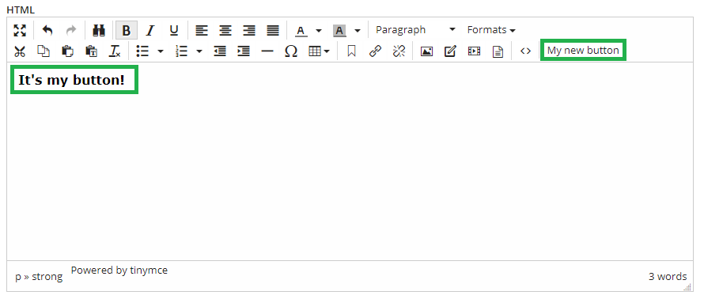
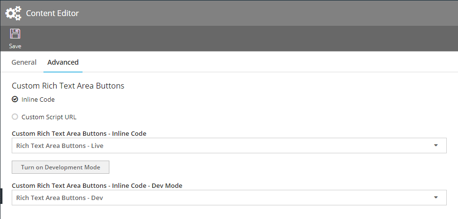
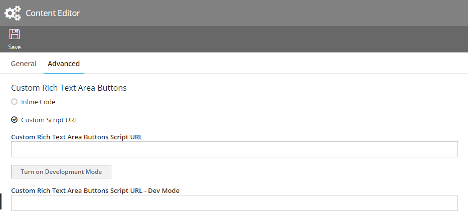

# HTML Field Custom Buttons
This repository showcases how you can add and build custom buttons in [Agility](https://agilitycms.com) for use in the WYSIWYG Editor. These implementations interface with the [TinyMCE](https://www.tiny.cloud/) javscript sdk to register a button and also provide a reference to [TinyMCE](https://www.tiny.cloud/) functions and objects such as the "editor" instance for further customization.

## Example
**Code (js):**
```javascript
/**
* Creates a new Agility Custom Rich Text Area Button.
* @class
* https://www.tiny.cloud/docs/advanced/creating-a-custom-button/
* 
*/

var FirstCustomButton = function () {

    /**
    * The type definition of this Agility Custom Rich Text Area Button.
    * @var {object} self
    */
    var self = this;

    /**
    * The internal reference name of the Custom Rich Text Area.
    * Must not contain any special characters and must be unique.
    * @member {string}
    */
    self.ReferenceName = "FirstCustomButtonName";

    /**
     * TinyMCE editor instance that will be initialized by CMS when the editor is rendered.
     */
    self.Editor = null;

    /**
     * Options of the custom tinymce editor button
     * @member {object}
     * Button configuration properties:
     * text - the text that will show up on the button
     * icon - CSS class for the icon (from one of the loaded stylesheets)
     * image - URL of the image (16x16 recommended) to use as an icon (overrides icon option if defined)
     * tooltip - tooltip to pop up on hover
     * onclick - callback to call when button is clicked
     * onpostrender - callback to call when button is rendered
     * cmd - editor command to invoke, when button is clicked (command should be registered prior to this, either by editor or by you)
     */
    self.Options = {
        text: 'My new button',
        icon: false,
        onclick: function () {
            self.Editor.insertContent('&nbsp;<strong>It\'s my button!</strong>&nbsp;');
        }
    };
};

ContentManager.Global.CustomRichTextAreaButtons.push(new FirstCustomButton());
```


## How it Works
Similar to [Custom Fields](https://github.com/AgilityInc/CustomFields), you need to implement a customization JS script file. This file will register your custom buttons and the function to be executed upon click. Your JS script file is a single file that can be stored externally and imported over a URL, or it can be stored within Inline Code in Agility.

## Setup Instructions

### Using Inline Code
1. Create a new JS Inline Code file by going to **Agility Content Manager > Settings > Customization/Development > Inline Code**.

2. Copy the [Sample Boilerplate](sample-boilerplate.js) file to get started as a boilerplate and paste that into your JS **Inline Code** file.

3.Go to **Settings > Customization/Development > Content Editor** and click on the Advanced Tab.



4. Select **Inline Code** for the *Custom Rich Text Area Buttons*.

5. Under *Custom Rich Text Area Buttons - Inline Code* dropdown, select your **Inline Code** file you created in the previous step.

6. Click *Save*.

7. Verify the custom button is working correctly by navigating to a content item or module that has an HTML field. If setup correctly, you should see your boilerplate custom button.

8. Now that you have the base working, modify the JS file to support your needs.

### Using Custom Script URL
1. Create a new JS file and copy the [Sample Boilerplate](sample-boilerplate.js) file to get started as a boilerplate and paste that into your JS file.

2. Upload your JS file to a location that can be accessed across-domains. You can upload this to **Agility Media & Documents**, or any other hosted file service.

3.Go to **Settings > Customization/Development > Content Editor** and click on the Advanced Tab.



4. Select **Custom Script URL** for the *Custom Rich Text Area Buttons*.

5. Under *Custom Rich Text Area Buttons Script URL* text field, enter the absolute URL to your hosted JS file.

6. Click *Save*.

7. Verify the custom button is working correctly by navigating to a content item or module that has an HTML field. If setup correctly, you should see your boilerplate custom button.

8. Now that you have the base working, modify the JS file to support your needs. 

**Quick Tip**: you can point your JS file from a localhost for quick updates, however keep in mind this can affect any live users that might be logged into the instance. See Testing below for more details on testing.

## Testing with Dev Mode
An important thing to note is that any misconfiguration or errors from your JS file/custom button can negatively impact users within the CMS instance. 

It is best practice to utilize the **Dev Mode** fields to test new buttons during development or breaking changes to an existing button.

You can turn on/off **Dev Mode** by clicking the **Turn on Development Mode** button within the *Content Editor > Advanced* window.

When you are in **Dev Mode**, only your session is loading the Dev scripts.


