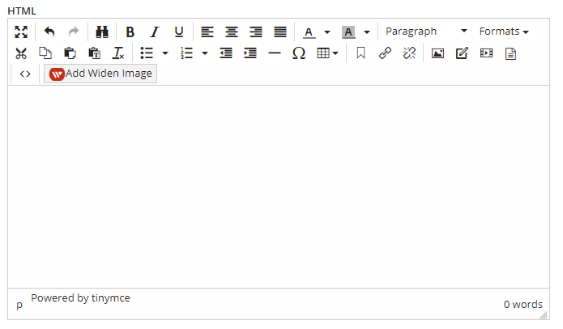
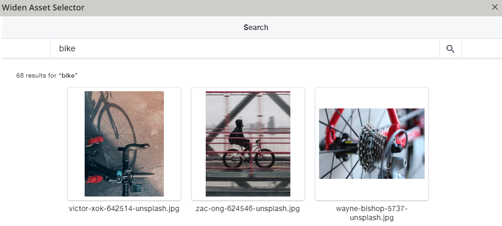
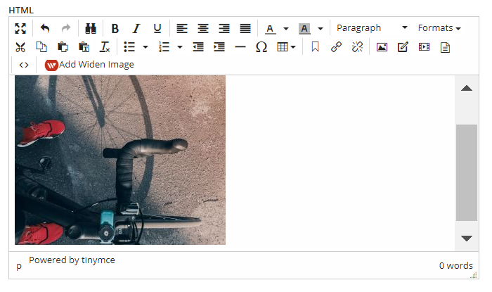

# Widen Asset Selector Button
This is an example custom button that allows editors to search and select an image/video from [Widen](https://www.widen.com/) and embed into the [Agility](https://agilitycms.com) HTML field.

## Setup Instructions
This assumes a basic understanding of how to setup a custom button. Please see the main [README](README.md) file general instructions.

1. Paste the contents of [widen-asset-selector-button-init.js](widen-asset-selector-button/widen-asset-selector-button-init.js) into your **Custom Buttons** JS file.

2. Set the **assetToken** field within the code.

3. Create a new inline code file to store the contents of the HTML template [widen-asset-selector-button-template.html](widen-asset-selector-button/widen-asset-selector-button-template.html) and give it a *ReferenceName* of **WidenAssetButtonTemplate**.

4. Verify the button is working on an HTML field within Agility.
